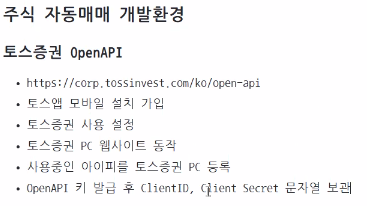

# ai-vibecoding-2026

## Chapter 1
### Concept:
- Original Development Method:
Analyze question -> Design DB/UI -> Execute/ debugging -> Test -> Deploy -> Maintenance

- Vibe Coding Method:
PRD (product requirements document) -> generate AI code/ debugging, test -> human verification and request modification -> deploy -> AI maintenance

### Vibe coding Dev Environment
- VS Code, VS Code Insiders, Android studio, ...
- VS Code extension: OpenAI Codex, Antrophic Claude

### CLI Codex
- open powershell 

## 주식 자동매매 environment
- 